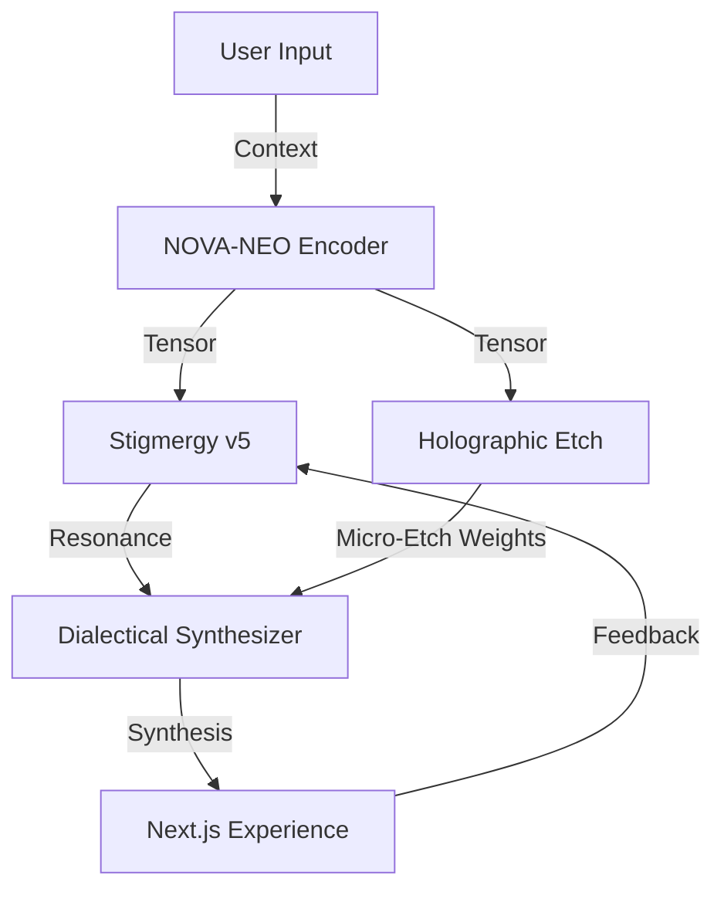

# MCOP Framework 2.0 🌌

[](https://github.com/Kuonirad/KullAILABS-MCOP-Framework-2.0/actions/workflows/ci.yml)
[](https://github.com/Kuonirad/KullAILABS-MCOP-Framework-2.0/actions/workflows/codeql.yml)
[](https://github.com/Kuonirad/KullAILABS-MCOP-Framework-2.0/releases)
[](LICENSE)
[](https://github.com/Kuonirad/KullAILABS-MCOP-Framework-2.0/graphs/contributors)
[](./GOVERNANCE.md)

Meta-Cognitive Optimization Protocol for deterministic, auditable triad orchestration: **NOVA-NEO Encoder**, **Stigmergy v5 Resonance**, and **Holographic Etch Engine**. Built with Next.js + TypeScript and ready for research, prototyping, and production hardening.

> Crystalline entropy targets, Merkle-tracked pheromones, and rank-1 micro-etches—packaged for real-world deployment.

## 🔭 Vision
- **Deterministic cognition**: Reproducible context tensors with explicit entropy metrics.
- **Provenance-first**: Merkle-style lineage for every pheromone trace and etch update.
- **Hardware-aware**: Clear seams for GPU/FPGA acceleration of rank-1 updates and similarity search.
- **Human-in-the-loop**: Dialectical synthesis loop that embraces audits, overrides, and replay.

## 📐 Architecture
See [ARCHITECTURE.md](ARCHITECTURE.md) for diagrams and data flows.



## 🧠 Active Kernels
- **NOVA-NEO Encoder**: Deterministic hashing pipeline to generate fixed-dimension tensors with optional normalization and entropy estimates.
- **Stigmergy v5**: Vector pheromone store with cosine resonance scoring, configurable thresholds, and Merkle-proof hashes.
- **Holographic Etch**: Rank-1 micro-etch accumulator that tracks confidence deltas and exposes replayable audit trails.

## 🏁 Getting Started

### Prerequisites
- Node.js 20+ (see `.nvmrc`)
- pnpm 9+ (pinned via `package.json` → `packageManager`; Corepack recommended)

### Installation
```bash
git clone https://github.com/Kuonirad/KullAILABS-MCOP-Framework-2.0.git
cd KullAILABS-MCOP-Framework-2.0
corepack enable                           # first-time only
pnpm install --frozen-lockfile
```

### Development
```bash
pnpm dev          # Next.js dev server with triad modules available under src/core
pnpm test         # Jest suite (security + triad seeds)
pnpm typecheck    # strict TypeScript check, no emit
pnpm lint         # ESLint, zero-warning budget
```
Visit `http://localhost:3000` after starting the dev server.

### Docker Compose
```bash
cp .env.example .env
docker compose up -d
```
For local code mounting add `docker-compose.override.yml`:
```yaml
services:
  mcop-app:
    build: .
    volumes:
      - .:/app
    environment:
      - NODE_ENV=development
```

## 🧩 Triad SDK (TypeScript)
Minimal usage of the triad seeds introduced in `src/core`:
```ts
import { NovaNeoEncoder } from './src/core/novaNeoEncoder';
import { StigmergyV5 } from './src/core/stigmergyV5';
import { HolographicEtch } from './src/core/holographicEtch';

const encoder = new NovaNeoEncoder({ dimensions: 64, normalize: true });
const stigmergy = new StigmergyV5();
const etch = new HolographicEtch();

const context = encoder.encode('dialectical synthesis');
const trace = stigmergy.recordTrace(context, context, { note: 'bootstrap' });
const resonance = stigmergy.getResonance(context);
const etchRecord = etch.applyEtch(context, trace.synthesisVector, 'unit test');
```

Configuration knobs live in [`config/examples/mcop.config.example.json`](config/examples/mcop.config.example.json) and map directly to constructor parameters.

## 🧪 Validation
- Jest tests cover security baselines and triad seed behaviors.
- Deterministic hashing avoids side effects in CI.
- Provenance hashes and audit-friendly logging enable replay.

## 🤝 Contributing

Contributors welcome. The project follows a lightweight governance model with lazy consensus on changes and an open review process.

- **Quickstart:** [CONTRIBUTOR_ONBOARDING.md](CONTRIBUTOR_ONBOARDING.md) — 30-minute runway for new contributors.
- **Good first issues:** [issues labeled `good first issue`](../../issues?q=is%3Aissue+is%3Aopen+label%3A%22good+first+issue%22).
- **Governance:** [GOVERNANCE.md](GOVERNANCE.md) — maintainers, decision model, and release process.
- **Protocol:** [CONTRIBUTING.md](CONTRIBUTING.md) — branch hygiene, PR template, and review expectations.

Topics: `typescript`, `nextjs`, `agent-framework`, `collective-intelligence`, `stigmergy`, `meta-cognitive-optimization`.

## 🔒 Security
Responsible disclosure details are in [SECURITY.md](SECURITY.md). No secrets belong in source; tests guard against accidental leaks.

## 🪪 License
MIT © Kevin Kull
