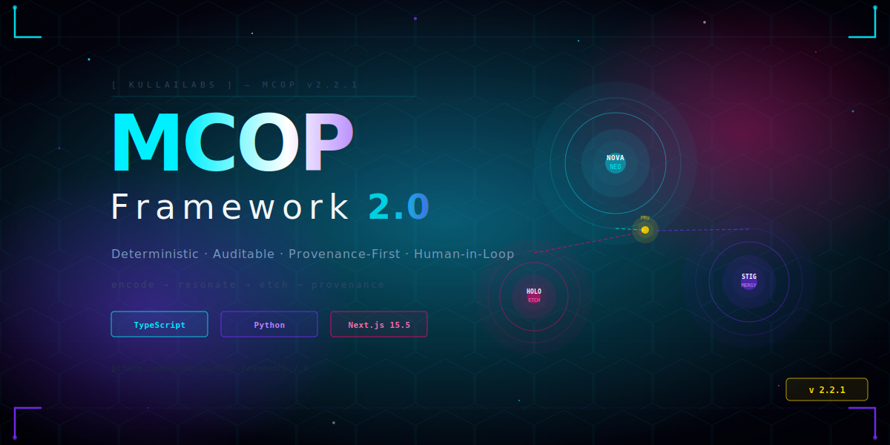
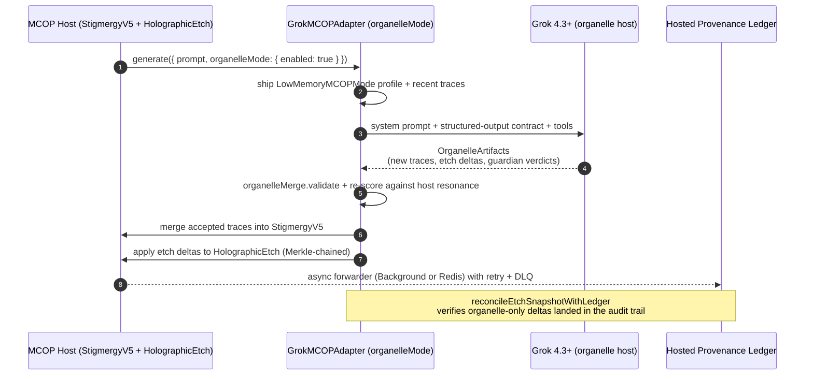

<div align="center">

# MCOP Framework 2.0

### The trust substrate for agent systems that must prove what they did

**Deterministic orchestration · Merkle-chained provenance · Positive-impact audits · Native desktop**

---

[](https://github.com/Kuonirad/MCOP-Framework-2.0/actions/workflows/ci.yml)
[](https://github.com/Kuonirad/MCOP-Framework-2.0/actions/workflows/codeql.yml)
[](https://www.bestpractices.dev/projects/12884)
[](https://scorecard.dev/viewer/?uri=github.com/Kuonirad/MCOP-Framework-2.0)
[](https://github.com/Kuonirad/MCOP-Framework-2.0/tree/badges/docs/badges)
[](https://github.com/Kuonirad/MCOP-Framework-2.0/releases)
[](LICENSE)
[](./GOVERNANCE.md)
[](./docs/POSITIVE_IMPACT_REPORT.md)
[](./docs/POSITIVE_IMPACT_REPORT.md)
[](./audit/positive-resonance-ledger.md)
[](./audit/positive-resonance-ledger.md)
[](./audit/positive-resonance-ledger.md)
[](./examples/reproducible-benchmark/README.md)
[](https://colab.research.google.com/github/Kuonirad/MCOP-Framework-2.0/blob/main/examples/reproducible-benchmark/notebooks/reproduce-22700-ops.ipynb)
<a href="https://tools.launchllama.co?utm_source=badge&utm_medium=referral" target="_blank" rel="noopener noreferrer"></a>

---

## ◆ Live Positive Impact Proof ◆

This repo **measures its own positive impact with MCOP primitives** —
[**100% current score, machine-verifiable**](./docs/POSITIVE_IMPACT_REPORT.md).

[`pnpm positive:audit`](./docs/POSITIVE_IMPACT_REPORT.md) regenerates the badge, report, shields.io endpoint metrics, and [holographic-etch ledger](./audit/positive-resonance-ledger.md) from commit-cited kernel evidence — not marketing copy.

---

### The pitch in one breath

Ship agents that **replay**. Ship decisions that **prove**. Ship products users can **double-click**.

| Why teams pick MCOP | What you get |
|:---|:---|
| **Trust you can audit** | Every accepted step is Merkle-chained — encode → recall → etch → hash |
| **Speed you can budget** | **4.4 ms / 22,700 ops/sec** deterministic full pipeline ([source](./docs/benchmarks/results.json)) |
| **Providers without lock-in** | OpenAI-compatible · Claude · DeepSeek · Kimi · Qwen · Grok/xAI · REST/MCP |
| **Impact that is not a slide** | Kernel-derived positive impact, ROI, and AI-velocity — CI-gated and replayable |
| **Zero-terminal product path** | **MCOP Desktop** (Tauri 2) — release-gated Windows + Linux installer pipeline; no system Node/pnpm in built packages |
| **Open source that stays open** | **Apache-2.0** · **92.18%** coverage · CodeQL · SBOM · OpenSSF Scorecard |

**Falsify first.** Rerun the harness before you trust the concept layer.
Headline baseline: **4.4 ms / 22,700 ops/sec** — backed by
[`docs/benchmarks/results.json`](./docs/benchmarks/results.json) and the
[`examples/reproducible-benchmark/`](./examples/reproducible-benchmark/README.md) Docker + Jupyter bundle.
External replay: [`docs/benchmarks/EXTERNAL_REPLAY.md`](./docs/benchmarks/EXTERNAL_REPLAY.md).

<p>
  <a href="./examples/reproducible-benchmark/README.md"><strong>Run the benchmark</strong></a> ·
  <a href="./examples/reproducible-benchmark/notebooks/reproduce-22700-ops.ipynb"><strong>Open the notebook</strong></a> ·
  <a href="./docs/DESKTOP_APP.md"><strong>Install the desktop app</strong></a> ·
  <a href="./COMPARISONS.md"><strong>Compare honestly</strong></a> ·
  <a href="./CONTRIBUTING.md#stigmergic-contribution-intake"><strong>Contribute a resonance report</strong></a> ·
  <a href="https://github.com/Kuonirad/MCOP-Framework-2.0/discussions"><strong>Discuss adoption</strong></a>
</p>

</div>

---

## ◆ What is MCOP?

**MCOP Framework 2.0** is a **recursive meta-cognitive optimization protocol** for AI agents —
a **deterministic trust substrate** any model stack can sit on, not another chatbot wrapper.

At the core: a **4.4 ms reasoning pipeline** (22,700 ops/sec) pairing

- **NOVA-NEO** — deterministic SHA-256 context encoding  
- **Stigmergy v5** — pheromone memory with Merkle-chained provenance  
- **Holographic Etch** — append-only confidence ledger with eudaimonic scoring  

**v2.4** ships the production expansion:

| Surface | Why it sells |
|:---|:---|
| **Proteome substrate** (150 nodes) | Edge-of-chaos + game-theoretic abstraction discovery under one seed |
| **ThermoTruth** (`F = U − T·S`) | Opt-in free-energy physics — Merkle-neutral, gated by `MCOP_ENABLE_THERMO` |
| **Drift Sentinel** | Δ(T_d, B_e) divergence telemetry for indirect-injection drift |
| **Guardian telemetry** | JCS-canonical policy, matrix-evolution, and L1 reset blocks |
| **Grok organelle host** | Bidirectional in-model triad execution with host-side Merkle merge |
| **Audit kernels** | Impact · verified-value (ROI) · AI-velocity — kernel-derived, never hand-written |
| **MCOP Desktop** | Tauri 2 product shell: Field · Dialectical Studio · Showcase, no terminal |

Adapter mesh: async OpenAI-compatible embeddings + chat, Anthropic Claude, DeepSeek, Kimi, Qwen, xAI/Grok (text + image), Magnific, Utopai, and generic REST/MCP/HTTP. Ledger-aware Holographic Etch factories ship **in-memory + file** backends, **async + Redis** forwarders (retry, DLQ, clean shutdown), and **snapshot ↔ ledger reconciliation**.

Cryptographic lineage at every step. **92.18%** test coverage. **Apache License 2.0.**

> **Why this matters:** unlike retrieval-augmented or chain-of-thought wrappers, MCOP makes **every reasoning step replayable**, **byte-identically reproducible** across Node, browser, and edge runtimes, and **auditable through a Merkle-chained provenance trail**. Memory, ledger, and adapter calls etch a positive-resonance score — the framework rewards **flourishing trajectories** (high alignment + high utility), not raw throughput alone.

## ◆ What MCOP is NOT

- **Not a chatbot wrapper** — it is a deterministic substrate under many model stacks.
- **Not a benchmark claim without replay** — public numbers must point to the reproducible harness.
- **Not a total replacement** for LangChain, AutoGen, or CrewAI in every workflow — see the comparison table and [`COMPARISONS.md`](./COMPARISONS.md).

## ◆ Why builders choose MCOP (the 100% pitch)

| If you need… | MCOP delivers… |
|:---|:---|
| **Regulated / high-stakes agents** | Replayable traces, sealed etches, and CI that fails when provenance lies |
| **Multi-provider flexibility** | One Universal Adapter Protocol — swap models without rewriting your trust layer |
| **Honest product metrics** | Impact, ROI, and AI-velocity derived from kernels and Merkle-sealed — not slideware |
| **Research → product** | Same triad in Docker, npm, Python, Next SSR, and **release-gated native desktop builds** |
| **Supply-chain hygiene** | CodeQL, SBOM (CycloneDX), Trojan-Source guard, pinned Node **22.23.1**, OIDC publish paths |

**Bottom line:** if your agent cannot show *what* it did, *why* it did it, and *that* a third party can rerun it — you do not have a product. You have a demo. MCOP is built so demos graduate into **auditable systems**.

## ◆ Current Production Surface

| Layer | Shipped surface |
|:---|:---|
| Deterministic core | `@kullailabs/mcop-core` — NOVA-NEO, Stigmergy v5, Holographic Etch, positive-resonance, canonical encoding, tensor guards, async embeddings |
| Telemetry hardening | [`src/telemetry/`](./src/telemetry/) — Guardian-signed resets, hazard policy, Peircean matrix evolution, burn-in traces |
| Orchestration hook | [`src/orchestrator/MCOPOrchestrator.ts`](./src/orchestrator/MCOPOrchestrator.ts) — optional hardening via DI + `commitPipelineStageExecution()` |
| Provider mesh | [`src/adapters/`](./src/adapters/) — OpenAI-compatible, Claude, DeepSeek, Kimi, Qwen, Grok/xAI, image, production REST/MCP |
| Organelle host & ledger I/O | Grok `organelleMode`, ledger-aware Etch factories, async/Redis forwarders, file + memory backends, snapshot reconciliation |
| Distributed runtime | Redis Streams gossip + in-memory bus ([`src/cluster/`](./src/cluster/)) |
| Audit kernels | Impact Auditor · Auditor Kernel (ROI) · Velocity Auditor — `pnpm positive:audit`, `pnpm audit:auditor-kernel`, `pnpm audit:velocity` |
| **Native product shell** | [`apps/desktop`](./apps/desktop) + [`docs/DESKTOP_APP.md`](./docs/DESKTOP_APP.md) — Tauri 2 release pipeline, checksum-pinned Node sidecar, Windows NSIS/MSI + Linux AppImage/deb |
| Security posture | CodeQL, Dependabot, Trojan-Source guard, SBOM, workflow hygiene, pinned CI runtimes |

Seven cognitive layers → live modules: [`docs/SEVEN_LAYER_MAPPING.md`](./docs/SEVEN_LAYER_MAPPING.md) · `SEVEN_LAYER_ROUTING` from `src/core`.

<div align="center">

[](./public/showcase/index.html)
[](https://mcop-framework.vercel.app)
[](https://www.npmjs.com/package/@kullailabs/mcop-core)

<a href="./public/showcase/index.html" title="Open the cinematic Three.js showcase">
  
</a>

<sub><em>The Three.js cinematic showcase — obsidian matcap crystals, live SHA-256 ticker, resonance meter,
adapter orbit, and a Tweaks panel for atmosphere · form · tempo. Best viewed at
<a href="./public/showcase/index.html"><code>/showcase/index.html</code></a> on a desktop browser —
or inside <strong>MCOP Desktop</strong> with zero terminal setup.</em></sub>

</div>

---

<div align="center">

## ◆ QUICK NAVIGATION ◆

[](./docs/api/README.md)
[](#quick-start)
[](#architecture)
[](./docs/adapters/UNIVERSAL_ADAPTER_PROTOCOL.md)
[](https://github.com/Kuonirad/MCOP-Framework-2.0/wiki)
[](./public/showcase/index.html)

</div>

---

## ◆ Why MCOP? · Comparison vs. mainstream agent frameworks

MCOP is **not** a chain-of-thought wrapper or a retrieval shim. It is a **deterministic,
cryptographically-verifiable substrate** that any LLM stack can sit on top of. The table below
contrasts core invariants against popular open-source agent frameworks (qualitative
feature comparison — public docs as of writing):

| Capability | **MCOP 2.0** | LangChain | AutoGen | CrewAI |
|:---|:---:|:---:|:---:|:---:|
| Deterministic, byte-identical pipeline (Node + browser + edge) | ✅ NOVA-NEO + NovaNeoWeb | ❌ | ❌ | ❌ |
| Merkle-chained provenance per reasoning step | ✅ Stigmergy v5 | ❌ | ❌ | ❌ |
| Append-only confidence ledger w/ replayable rank-1 etches | ✅ Holographic Etch | ❌ | ❌ | ❌ |
| Eudaimonic / positive-resonance scoring on every accepted etch | ✅ EudaimonicEtch | ❌ | ❌ | ❌ |
| Self-healing dimension + bounded-curiosity recall guards | ✅ SelfHealingDimension + ResonantRecentQuery | ❌ | ❌ | ❌ |
| Kernel-derived value & AI-velocity proofs (ROI + ×-velocity, Merkle-sealed) | ✅ Impact Auditor + Auditor Kernel + Velocity Auditor | ❌ | ❌ | ❌ |
| Universal Adapter Protocol (OpenAI-compatible · Claude · DeepSeek · Kimi · Qwen · Grok/xAI · production REST/MCP) | ✅ | ✅ | ⚠️ partial | ⚠️ partial |
| Native xAI Grok adapter (text + image generation) | ✅ | ⚠️ community | ❌ | ❌ |
| Zero-terminal native desktop (Windows + Linux) | ✅ Tauri 2 product shell | ❌ | ❌ | ❌ |
| Test coverage on documented API surface | **92.18%** | varies | varies | varies |
| Reference benchmark (full pipeline) | **4.4 ms / 22,700 ops/sec** ([source](./src/benchmarks/promptingModes.ts)) | n/a | n/a | n/a |
| License posture | **Apache-2.0** | MIT | CC-BY-4.0 / MIT | MIT |
| CodeQL + SBOM (CycloneDX) + Trojan-Source guard in CI | ✅ | ⚠️ partial | ⚠️ partial | ⚠️ partial |
| Trusted publishing (OIDC, secretless) to npm + PyPI | ✅ | ❌ | ❌ | ❌ |

> Numbers are **regression baselines** from [`src/benchmarks/promptingModes.ts`](./src/benchmarks/promptingModes.ts)
> (re-run with `pnpm benchmark:refresh`, baseline at [`docs/benchmarks/results.json`](./docs/benchmarks/results.json)).
> They are budgeting targets for the deterministic core — **not** a head-to-head LLM-quality claim.

---

## 🌱 Positive Impact & Flourishing

MCOP is designed so **positive impact is a first-class, self-improving observable** —
not a paragraph bolted on after the pipeline runs.

Alignment, provenance, and beneficial outcomes are encoded into the substrate.
Accepted memory, ledger, and adapter etches carry eudaimonic scoring through the same
deterministic, Merkle-chained mechanisms that power core cognition: NOVA-NEO,
Stigmergy v5, Holographic Etch, `PositiveResonanceAmplifier`, and `EudaimonicScoringLedger`.

That creates a recursive loop: the primitives that let agents reason with verifiable
provenance also **observe, score, and refine the project's own impact surface**.

```bash
pnpm positive:audit
```

invokes this loop. The `ImpactAuditor` ([`src/audit/impactAuditor.ts`](./src/audit/impactAuditor.ts))
routes live verification through the framework's own kernels — NOVA-NEO encodes each
check, Holographic Etch scores it as a eudaimonic etch, the `PositiveResonanceAmplifier`
records a Merkle-chained growth event and derives contributor-joy / adoption-velocity /
beneficial-outcome metrics, and a Proteome substrate (edge-of-chaos knobs conditioned by
the audit pass ratio) contributes equilibrium stability. It regenerates
[`docs/POSITIVE_IMPACT_REPORT.md`](./docs/POSITIVE_IMPACT_REPORT.md), appends
[`audit/positive-resonance-ledger.md`](./audit/positive-resonance-ledger.md), and refreshes
shields.io endpoint JSON in [`.github/metrics`](./.github/metrics).

Those citations are **falsifiable**. [`audit/positive-impact-attestation.json`](./audit/positive-impact-attestation.json)
snapshots recorded inputs and cited outputs; `pnpm positive:verify` (CI gate) replays them
byte-for-byte. Regenerate with `pnpm positive:attest`. Phase 3 quality assessment uses a
`ProteomeOrchestrator`-seeded adversarial suite; `pnpm positive:quality` asserts the verifier
catches every forgery.

Sibling **audit kernels** turn provenance into accounting:

| Kernel | Command | Proves |
|:---|:---|:---|
| Impact Auditor | `pnpm positive:audit` | Positive impact score + growth metrics |
| Auditor Kernel | `pnpm audit:auditor-kernel` | Verified value / ROI of a merged cycle |
| Velocity Auditor | `pnpm audit:velocity` | AI-velocity multiplier, hours saved, eudaimonic delta |

This is not ethics-washing. It is the framework practicing its thesis:
**advanced systems become more valuable when they can see, score, and steer toward flourishing trajectories.**

- **Canonical home:** `https://github.com/Kuonirad/MCOP-Framework-2.0`
- **Unique capability:** native positive-resonance scoring on every accepted etch — positive impact as a measurable, self-referential signal

---

## ◆ Native GitHub Surfaces

| Surface | Use it for |
|:---|:---|
| [Adoption wins and impact stories](https://github.com/Kuonirad/MCOP-Framework-2.0/discussions/categories/show-and-tell) | Public outcomes, downstream demos, evidence MCOP improved a real workflow |
| [Reproducibility and audit questions](https://github.com/Kuonirad/MCOP-Framework-2.0/discussions/categories/q-a) | Benchmark, replay, provenance, and claim-audit questions |
| [Good first contributions](https://github.com/Kuonirad/MCOP-Framework-2.0/issues?q=is%3Aissue%20is%3Aopen%20label%3A%22good%20first%20issue%22) | Scoped first issues with a clear verification path |
| [Integration requests](https://github.com/Kuonirad/MCOP-Framework-2.0/issues/new?template=integration_request.yml) | Adapter, bridge, example, or downstream integration proposals |
| [Trust substrate roadmap](./docs/TRUST_SUBSTRATE_ROADMAP.md) | CUDA, cluster, and hosted-ledger gates on the public board |

---

## 🧠 System Architecture

<a id="architecture"></a>

```
┌─────────────────────────────────────────────────────────────────┐
│                    MCOP PROCESSING PIPELINE                     │
│                                                                 │
│   INPUT  ──►  NOVA-NEO  ──►  STIGMERGY  ──►  HOLO-ETCH  ──►    │
│                  ▲                                  ▼           │
│                  │                            PROVENANCE        │
│            (v2.4) PROTEOME  ◀── graphAggregate ──┘              │
│                                                                 │
│   ◆ Entropy-Normalized   ◆ Merkle-Chained   ◆ Rank-1 Tensor    │
│   ◆ Cosine Recall        ◆ SHA-256 Signed   ◆ UUID-v4 Traced    │
│   ◆ Edge-of-Chaos        ◆ Game-Theoretic Equilibria (v2.4)     │
└─────────────────────────────────────────────────────────────────┘
```

<div align="center">

| Kernel | Class | Role | Key Property |
|:---:|:---:|:---:|:---:|
| 💙 **NOVA-NEO Encoder** | `NovaNeoEncoder` | Context → Tensor | Deterministic · Entropy-normalized |
| 🟣 **Stigmergy v5** | `StigmergyV5` | Pheromone memory | Cosine recall · Merkle-chained |
| 🔴 **Holographic Etch** | `HolographicEtch` | Confidence ledger | Append-only · Rank-1 · Replayable |
| 🧬 **Proteome (v2.4)** | `ProteomeOrchestrator` | 150-node sparse substrate | Replicator dynamics · Edge-of-chaos · CUDA-routed |
| 🔥 **ThermoTruth** | `thermoTruthKernel` | Free-energy physical constraint (opt-in) | `F = U − T·S` · Deterministic · Merkle-neutral |
| 🛰️ **Drift Sentinel** | `DriftSentinelKernel` | Δ(T_d, B_e) sensor for indirect-injection drift | Welford-online σ-threshold · Stigmergic signals · Merkle-linked rewind |
| 🟡 **Provenance** | `ProvenanceMetadata` | Cryptographic lineage | SHA-256 · ISO8601 · UUID-v4 |

</div>

---

## ◈ MCOP Desktop — double-click the product

<div align="center">

**No system Node. No pnpm. No Python. No Docker. No terminal.**

The [Tauri 2](./docs/DESKTOP_APP.md) product shell builds the motion-glass field,
Dialectical Studio, and cinematic showcase into **native Windows and Linux installers**.
A checksum-**pinned** Node **22.23.1** sidecar and Next standalone runtime ship inside
the app — the host `PATH` is never consulted.

| Platform | What you ship |
|:---|:---|
| **Windows** | NSIS `.exe` + WiX `.msi` |
| **Linux** | AppImage + Debian `.deb` |

The repository ships the build and release pipeline, not a promise that a
public installer already exists. Downloads are published only by a successful
`desktop-v<version>` tagged CI run; check the
[GitHub Releases page](https://github.com/Kuonirad/MCOP-Framework-2.0/releases)
for current availability.

Deep links: `mcop://dialectical` · `mcop://showcase`

[**Read the desktop operator guide →**](./docs/DESKTOP_APP.md) ·
[`apps/desktop`](./apps/desktop) · CI matrix [`.github/workflows/desktop.yml`](./.github/workflows/desktop.yml)

</div>

The loopback UI gets a **deliberately narrow** capability surface (window controls only) —
no shell, filesystem, process, or secret-storage bridge — so cinematic CDN scripts never
inherit privileged native APIs. Web, Docker, npm, and Python surfaces remain first-class
for developers and reproducible research.

---

## ⚡ Get Started in 90 Seconds

<a id="quick-start"></a>

```bash
# 1. Clone the recursive triad (≈20 s)
git clone https://github.com/Kuonirad/MCOP-Framework-2.0.git
cd MCOP-Framework-2.0

# 2. Activate the pinned toolchain (Node 22.23.1 + pnpm 9.15.0) (≈10 s)
nvm use
corepack enable
corepack prepare pnpm@9.15.0 --activate

# 3. Install workspace dependencies (≈30 s on a warm cache)
pnpm install

# 4. Run the deterministic Jest suite — 92.18% covered (≈20 s)
pnpm test

# 5. Generate the Positive Impact Report + Merkle-anchored audit badge (≈5 s)
pnpm positive:audit

# 6. Launch the production server (Next.js 15.5.18 SSR, port 3000)
pnpm build && pnpm start

# 7. Optional — open the Three.js cinematic showcase locally
#    (served as a static asset under /showcase/index.html)
open http://localhost:3000/showcase/index.html
```

> Need the **public TypeScript core** without cloning? Install
> [`@kullailabs/mcop-core`](https://www.npmjs.com/package/@kullailabs/mcop-core).
> Its supported code entry point is the package root, including
> `NovaNeoEncoder`, `StigmergyV5`, and `HolographicEtch`; adapter, integration,
> ledger, Proteome, Drift Sentinel, CUDA, and app modules remain source-only.
> The monorepo root package, `@kuonirad/mcop-framework`, is a private workspace
> application and is not installable from npm.
>
> Prefer a **zero-terminal** start? Build or install **MCOP Desktop** — see [`docs/DESKTOP_APP.md`](./docs/DESKTOP_APP.md).

| TypeScript / npm | Python / PyPI |
|:---|:---|
| `npm install @kullailabs/mcop-core` | `python -m pip install mcop` |
| Public root import: `@kullailabs/mcop-core` | Public top-level import: `mcop` |

The Python example below targets MCOP protocol 2.4 in the Python 4.0
distribution line. Protocol and distribution versions are independent, and
this repository documentation does not imply that an unreleased version is
already available from either registry.

### TypeScript

```typescript
import {
  HolographicEtch,
  NovaNeoEncoder,
  StigmergyV5,
} from '@kullailabs/mcop-core';

const encoder = new NovaNeoEncoder({ dimensions: 64, normalize: true });
const memory = new StigmergyV5({ resonanceThreshold: 0.55 });
const ledger = new HolographicEtch({
  confidenceFloor: 0,
  growthLedger: true,
});

const context = encoder.encode('stabilize recursive planning with audited provenance');
const synthesis = encoder.encode('stabilize recursive planning with audited provenance');

const trace = memory.recordTrace(context, synthesis, { stage: 'quick-start' });
const etch = ledger.applyEtch(context, synthesis, 'quick-start');

console.log({
  traceHash: trace.hash,
  merkleRoot: memory.getMerkleRoot(),
  etchHash: etch.hash,
  confidence: etch.deltaWeight,
});
```

### Python

```python
from mcop import HolographicEtch, NovaNeoEncoder, StigmergyV5

encoder = NovaNeoEncoder(dimensions=64, normalize=True)
memory = StigmergyV5(resonance_threshold=0.55)
ledger = HolographicEtch(confidence_floor=0.0)

context = encoder.encode("stabilize recursive planning with audited provenance")
synthesis = encoder.encode("stabilize recursive planning with audited provenance")

trace = memory.record_trace(context, synthesis, {"stage": "quick-start"})
etch = ledger.apply_etch(context, synthesis, "quick-start")

print({
    "trace_hash": trace.hash,
    "merkle_root": memory.get_merkle_root(),
    "etch_hash": etch.hash,
    "confidence": etch.delta_weight,
})
```

---

## 🗺️ Documentation Map

| Need | Start here |
|:---|:---|
| **Desktop product (zero-terminal)** | [`docs/DESKTOP_APP.md`](./docs/DESKTOP_APP.md) |
| 12-month roadmap | [`ROADMAP.md`](./ROADMAP.md) |
| Public API and coverage surface | [`docs/api/README.md`](./docs/api/README.md) |
| SBOM generation and validation | [`docs/sbom/README.md`](./docs/sbom/README.md) |
| Workspace layout (monorepo) | [`docs/MONOREPO.md`](./docs/MONOREPO.md) |
| Branch cleanup strategy | [`docs/audits/branch-cleanup-strategy.md`](./docs/audits/branch-cleanup-strategy.md) |
| Audit & remediation protocol (PARP v1.0) | [`docs/audits/PARP-v1.0.md`](./docs/audits/PARP-v1.0.md) — run baseline with `pnpm audit:parp-baseline` |
| Security posture notes | [`docs/SECURITY-POSTURE-NOTES.md`](./docs/SECURITY-POSTURE-NOTES.md) |
| Due-diligence register | [`docs/DUE_DILIGENCE_REGISTER.md`](./docs/DUE_DILIGENCE_REGISTER.md) |
| Trust-substrate roadmap | [`docs/TRUST_SUBSTRATE_ROADMAP.md`](./docs/TRUST_SUBSTRATE_ROADMAP.md) |
| CUDA productionization | [`docs/CUDA_PRODUCTION.md`](./docs/CUDA_PRODUCTION.md) |
| Proteome layer and ARC LS20 scaffold | [`docs/PROTEOME_LAYER.md`](./docs/PROTEOME_LAYER.md) |
| ThermoTruth free-energy layer (opt-in) | [`src/core/thermoTruthKernel.ts`](./src/core/thermoTruthKernel.ts) · `MCOP_ENABLE_THERMO` |
| Drift Sentinel Kernel | [`docs/features/drift-sentinel-kernel.md`](./docs/features/drift-sentinel-kernel.md) |
| Audit kernels (Impact · Verified-Value · AI-Velocity) | [`src/audit/`](./src/audit/) |
| Velocity Auditor deep dive | [`docs/features/velocity-auditor.md`](./docs/features/velocity-auditor.md) |
| Bidirectional Grok-MCOP organelle host | [`docs/adapters/GROK_AS_MCOP_ORGANELLE_HOST.md`](./docs/adapters/GROK_AS_MCOP_ORGANELLE_HOST.md) |
| Runnable organelle host experiment | [`examples/grok_mcop_organelle_experiment.ts`](./examples/grok_mcop_organelle_experiment.ts) |
| Decentralized agent coordination | [`docs/DECENTRALIZED_AGENT_COORDINATION.md`](./docs/DECENTRALIZED_AGENT_COORDINATION.md) |
| Redis Streams cluster transport | [`docs/DISTRIBUTED_CLUSTER_MODE.md`](./docs/DISTRIBUTED_CLUSTER_MODE.md) |
| Cross-node stigmergic replay proof | [`examples/cluster_stigmergy_replay.ts`](./examples/cluster_stigmergy_replay.ts) — `pnpm cluster:replay` |
| Telemetry hardening source | [`src/telemetry/`](./src/telemetry/) |
| Architecture overview | [`ARCHITECTURE.md`](./ARCHITECTURE.md) |
| Supply-chain controls | [`docs/SUPPLY_CHAIN_TRUST.md`](./docs/SUPPLY_CHAIN_TRUST.md) |
| Universal Adapter Protocol | [`docs/adapters/UNIVERSAL_ADAPTER_PROTOCOL.md`](./docs/adapters/UNIVERSAL_ADAPTER_PROTOCOL.md) |
| Contributor workflow | [`CONTRIBUTING.md`](./CONTRIBUTING.md) |

## 🏷️ Badge Legend

| Badge | Meaning | Source |
|:---|:---|:---|
| Build and Test | Merge-blocking lint, typecheck, test, build, security, and package checks. | [`.github/workflows/ci.yml`](./.github/workflows/ci.yml) |
| CodeQL | Static analysis for JavaScript/TypeScript and security query suites. | [`.github/workflows/codeql.yml`](./.github/workflows/codeql.yml) |
| Coverage | Live Jest line-coverage badge, regenerated from `coverage/coverage-summary.json` by `scripts/coverage-badge.mjs` and auto-published to the [`badges`](https://github.com/Kuonirad/MCOP-Framework-2.0/tree/badges/docs/badges) branch on every push to `main` (see the `publish-badge` job in [`.github/workflows/ci.yml`](./.github/workflows/ci.yml)). | [badge](https://raw.githubusercontent.com/Kuonirad/MCOP-Framework-2.0/badges/docs/badges/coverage.svg) · [`scripts/coverage-badge.mjs`](./scripts/coverage-badge.mjs) |
| Release | Latest GitHub release tag. | [Releases](https://github.com/Kuonirad/MCOP-Framework-2.0/releases) |
| License | Apache License 2.0 — see `LICENSE`. | [`LICENSE`](./LICENSE) |
| Maintained | Governance and maintainer process are documented. | [`GOVERNANCE.md`](./GOVERNANCE.md) |
| Positive Impact | Eudaimonic / positive-resonance audit score; refreshed by `pnpm positive:audit`. | [`docs/badges/positive-impact.svg`](./docs/badges/positive-impact.svg) · [`docs/POSITIVE_IMPACT_REPORT.md`](./docs/POSITIVE_IMPACT_REPORT.md) |
| Impact Score / Contributor Joy / Adoption Velocity / Beneficial Amplification | Dynamic shields.io endpoint badges for the four ImpactAuditor metrics; refreshed by the scheduled and release measurement loop. | [`.github/metrics`](./.github/metrics) · [`audit/positive-resonance-ledger.md`](./audit/positive-resonance-ledger.md) |

---

## 📊 Performance Metrics

<div align="center">

[](./examples/reproducible-benchmark/README.md)
[](./examples/reproducible-benchmark/README.md)
[](./examples/reproducible-benchmark/README.md)
[](./examples/reproducible-benchmark/README.md)

</div>

```
  BENCHMARK RESULTS  ──────────────────────────────────────────
  ┌────────────────────────┬──────────────┬───────────────────┐
  │ Operation              │ Latency      │ Throughput        │
  ├────────────────────────┼──────────────┼───────────────────┤
  │ Context Encoding       │ 2.1 ms       │ 47,600 ops/sec    │
  │ NovaNeoWeb Encoding    │ 2.1 ms       │ 47,600 ops/sec    │
  │ Stigmergy Recall       │ 0.8 ms       │ 125,000 ops/sec   │
  │ ResonantRecentQuery    │ 0.8 ms       │ 125,000 ops/sec   │
  │ Holographic Etch Write │ 1.2 ms       │ 83,300 ops/sec    │
  │ Eudaimonic Etch Score  │ 0.1 ms       │ 1M+ ops/sec       │
  │ Provenance Hash        │ 0.3 ms       │ 333,000 ops/sec   │
  │ Full Pipeline          │ 4.4 ms       │ 22,700 ops/sec    │
  └────────────────────────┴──────────────┴───────────────────┘
```

These are deterministic benchmark baselines generated by `src/benchmarks/promptingModes.ts` for regression budgeting, not vendor hardware claims. Re-run with `pnpm benchmark:refresh` and compare `docs/benchmarks/results.json` before publishing new public numbers.

### ◆ Reproducibility — `Reproducible 22,700 ops/sec · verified 2026-05-10`

The headline budget above is **byte-identity-reproducible** by any third party in 90 seconds via the
[`examples/reproducible-benchmark/`](./examples/reproducible-benchmark/README.md) Docker bundle. The bundle:

1. Pins **Node 22.23.1 + pnpm 9.15.0 + Python 3.12** to match the org blueprint.
2. Re-runs `pnpm benchmark:refresh` (`BENCHMARK_GENERATE=1 jest --testPathPatterns=src/__tests__/benchmarks.test.ts`) inside a clean container.
3. Asserts the regenerated `docs/benchmarks/results.json` is **byte-for-byte identical** to the committed snapshot — any drift exits the verifier non-zero.
4. Computes a **SHA-256 over the regenerated artefact** and emits a [`manifest.json`](./examples/reproducible-benchmark/README.md#what-this-bundle-proves) carrying verdict, both SHAs, and the headline-budget numbers.
5. Re-asserts every invariant from inside Python via [`reproduce-22700-ops.ipynb`](./examples/reproducible-benchmark/notebooks/reproduce-22700-ops.ipynb), so a reader who only trusts the Python tooling can still self-certify.

One-liner from the repo root:

```bash
docker build -t mcop-reproducible-benchmark -f examples/reproducible-benchmark/Dockerfile . \
  && docker run --rm -v "$PWD/examples/reproducible-benchmark/out:/out" mcop-reproducible-benchmark
```

The v2.4 preprint scaffold backing this badge lives at
[`docs/benchmarks/preprint/`](./docs/benchmarks/preprint/README.md) — arXiv `cs.SE` + Hugging Face mirror + Zenodo DOI, all
verification provenance derived from the bundle's `manifest.json`.

See [POSITIVE_EVOLUTION.md](./POSITIVE_EVOLUTION.md) for the v2.3 Eudaimonic Bloom audit response: negative-limit safety, NovaNeoWeb universal encoding, SelfHealingDimension, ResonantRecentQuery, and EudaimonicEtch.

---

## 🔌 Universal Adapter Protocol

<div align="center">

| Adapter | Status | Protocol | Auth |
|:---:|:---:|:---:|:---:|
| 🤖 **OpenAI-compatible chat + embeddings** |  | REST/SSE | Bearer |
| 🧬 **Anthropic Claude** |  | REST | x-api-key |
| 🌊 **DeepSeek** |  | REST | Bearer |
| 🌙 **Kimi** |  | REST | Bearer |
| ⚡ **Qwen** |  | REST | Bearer |
| ✦ **xAI Grok text + image** |  | REST | Bearer |
| 🎛️ **Magnific / Utopai / Generic Production** |  | REST/MCP/HTTP | Provider-specific |

</div>

---

## 🔗 Ecosystem Integrations

> **Phase 4 of v2.4 — shipped.** MCOP plugs into LangChain, LlamaIndex, and Haystack as a Merkle-rooted memory layer, and exposes itself as a stdio MCP server for Claude Desktop / Cursor / Continue. Every shim lands in the host pipeline **without** a runtime dependency on the upstream library, so the same shim file is the basis for an upstream PR.
>
> These integration shims ship as repository source. They are not deep-import
> subpaths of the public `@kullailabs/mcop-core` package.

| Target | TS shim | Python shim | Status |
|---|---|---|:---:|
| **LangChain** ([guide](docs/integrations/langchain.md)) | [`src/integrations/langchain.ts`](src/integrations/langchain.ts) | [`mcop_package/mcop/integrations/langchain.py`](mcop_package/mcop/integrations/langchain.py) |  |
| **LlamaIndex** ([guide](docs/integrations/llamaindex.md)) | [`src/integrations/llamaIndex.ts`](src/integrations/llamaIndex.ts) | [`mcop_package/mcop/integrations/llamaindex.py`](mcop_package/mcop/integrations/llamaindex.py) |  |
| **Haystack** ([guide](docs/integrations/haystack.md)) | [`src/integrations/haystack.ts`](src/integrations/haystack.ts) | [`mcop_package/mcop/integrations/haystack.py`](mcop_package/mcop/integrations/haystack.py) |  |
| **MCP Memory Server** ([guide](docs/integrations/mcp-memory-server.md)) | [`examples/mcop_memory_mcp_server/`](examples/mcop_memory_mcp_server/) | — |  |

The full upstream submission plan lives in [`docs/integrations/UPSTREAM_SUBMISSION_PLAN.md`](docs/integrations/UPSTREAM_SUBMISSION_PLAN.md).

```ts
// LangChain — drop-in BaseChatMessageHistory backed by MCOP triad
// Source checkout only; run this example from the repository root.
import { createMCOPLangChainMemory } from './src/integrations/langchain';

const memory = createMCOPLangChainMemory({ sessionId: 'agent-007' });
await memory.addMessages([{ type: 'human', content: 'who is paul atreides' }]);
console.log((await memory.getMessages())[0].provenance?.merkleRoot);
//=> "f3c1e7…"  ← byte-identical with the Python shim
```

---

## 🛡️ Security & Provenance

```
  CRYPTOGRAPHIC CHAIN OF CUSTODY
  ════════════════════════════════════════════════════════════

  Step 1: INPUT
    └── UUID-v4 assigned: 550e8400-e29b-41d4-a716-446655440000

  Step 2: NOVA-NEO ENCODING
    └── SHA-256: a3f8c2d1e4b7f9a2c5d8e1f4a7b2c5d8...
    └── Entropy score: 0.9847 (normalized)

  Step 3: STIGMERGY RECALL
    └── Merkle root: 8f4a2c1d9e7b3f5a8c2d4e6f8a1b3c5d
    └── Cosine similarity: 0.9923

  Step 4: HOLOGRAPHIC ETCH
    └── Rank-1 tensor stored | ISO8601: 2025-01-15T10:30:00Z
    └── Append-only ledger: SEALED ✓

  Step 5: PROVENANCE METADATA
    └── Final hash: SHA-256 verified
    └── License: Apache License 2.0 | Apache-2.0
    └── See also: NOTICE.md | LICENSE-MIT-LEGACY
  ════════════════════════════════════════════════════════════
```

---

## 📦 Tech Stack

<div align="center">

[](https://nextjs.org)
[](https://typescriptlang.org)
[](https://nodejs.org)
[](./Dockerfile)
[](./jest.config.js)
[](./eslint.config.mjs)

</div>

---

## 📁 Repository Structure

```
MCOP-Framework-2.0/
├── 🧠 src/
│   ├── core/                      # NOVA-NEO, Stigmergy, Etch, Drift Sentinel, embeddings, storage backends
│   ├── audit/                     # Impact Auditor, Auditor Kernel (ROI), Velocity Auditor (AI-velocity proofs)
│   ├── adapters/                  # Provider mesh + Universal Adapter Protocol + organelle host
│   ├── telemetry/                 # Guardian-signed hardening and reset-block commits
│   ├── orchestrator/              # Dependency-injected orchestration hooks
│   ├── ledger/                    # Ledger-aware Etch factories + async/Redis forwarders (retry, DLQ)
│   ├── utils/                     # organelleMerge + snapshot ↔ ledger reconciliation
│   ├── cluster/                   # In-memory + Redis Streams gossip transports
│   ├── proteome/                  # Proteome substrate and ARC LS20 scaffolding
│   └── hardware/                  # CUDA/ONNX/HTTP accelerator surfaces
├── 📦 packages/
│   └── core/                      # Published @kullailabs/mcop-core package
├── 🐍 mcop_package/               # Python package, adapters, CLI, and parity shims
├── 🧾 services/
│   └── ledger/                    # Hosted provenance ledger service + Helm values schema
├── 📚 docs/
│   ├── api/                       # Full API reference
│   ├── adapters/                  # Adapter protocol specs
│   ├── cuda/                      # Kernel manifest mirrors
│   ├── features/                  # Drift Sentinel and feature deep dives
│   └── observability/             # Grafana / Datadog operator templates
├── 🧪 src/__tests__/              # Jest coverage suite
├── 🔧 scripts/                    # Benchmarks, guards, SBOM, telemetry registry
├── 🐳 Dockerfile                  # Production container
├── 📋 GOVERNANCE.md               # Project governance
├── 🔒 SECURITY.md                 # Security policy
└── ⚖️  LICENSE                    # Apache License 2.0
```

---

## 🗺️ Roadmap

<div align="center">

| Milestone | Status | Target |
|:---|:---:|:---:|
| 🟢 Core Triad Engine |  | v2.0 |
| 🟢 Universal Adapter Protocol |  | v2.1 |
| 🟢 Merkle-Chained Stigmergy |  | v2.2 |
| 🟢 CUDA Hardware Layer (Φ1–Φ5 scaffolding) |  | v2.3 |
| 🟢 Proteome Layer + LS20 ARC scaffold |  | v2.4 |
| 🟢 Drift Sentinel + Guardian telemetry hardening |  | v2.4 |
| 🟢 ThermoTruth free-energy layer (opt-in, `MCOP_ENABLE_THERMO`) |  | v2.4 |
| 🟢 Redis Streams gossip transport |  | v2.4 |
| 🟢 Bidirectional Grok-MCOP organelle host (`organelleMode` + ledger forwarders + reconciliation) |  | v2.4 |
| 🟢 Audit kernels (Impact · Auditor Kernel · Velocity Auditor) |  | v2.4 |
| 🟢 Tauri 2 Desktop product shell + gated Windows/Linux installer pipeline |  | v2.4 |
| 🟡 CUDA Productionization |  | v2.4+ |
| 🟡 LS20 ARC real-task ingestion |  | v2.5 |
| 🔵 Hosted Provenance Ledger |  | v3.x |
| 🔵 WebAssembly Runtime |  | v3.1 |

</div>

## 🚀 v2.3 Hardware Acceleration (CUDA Layer)

The v2.3 release scaffolds the optional **CUDA Hardware Layer** around two provider surfaces: the in-process ONNX layer and the HTTP accelerator bridge. The triad still byte-identically reproduces on CPU; CUDA remains provenance-attested and disabled or probe-driven unless explicitly enabled. Reference kernel artifacts, their deterministic export pipeline, and the Python CUDA server are shipped. Real-GPU validation, GPU CI, and full hot-path unification remain productionization work tracked in [`docs/CUDA_PRODUCTION.md`](./docs/CUDA_PRODUCTION.md).

### Shipped surfaces

| Surface | File | Role |
|:---|:---|:---|
| In-process ONNX layer | [`src/hardware/CUDAHardwareLayer.ts`](src/hardware/CUDAHardwareLayer.ts) | Phi5 `enableCUDA: 'auto'` probe, verified-device gate, `substrateLineage`, and `resolvedFrom` provenance |
| HTTP bridge client | [`src/hardware/Accelerator.ts`](src/hardware/Accelerator.ts), [`src/hardware/CUDAAccelerator.ts`](src/hardware/CUDAAccelerator.ts) | `CUDAProvider` client contract with CPU fallback |
| Config surface | [`src/config/mcop.config.ts`](src/config/mcop.config.ts) | `hardware.useCUDA`, `hardware.provider`, `hardware.enableCUDA`, and `hardware.kernelDir` defaults |
| Benchmarks | [`scripts/benchmark-cuda-graph.mjs`](scripts/benchmark-cuda-graph.mjs) | CPU-stable smoke and full-mode harness across all six logical ops |
| Verified-device soak | [`scripts/cuda-verified-device-soak.mjs`](scripts/cuda-verified-device-soak.mjs) | Structural soak plus GhostGPU canary |
| Reference kernels + manifest | [`models/`](models/) | Six committed ONNX reference artifacts with SHA-256/Merkle manifest |
| Deterministic export pipeline | [`scripts/export_cuda_kernels/`](scripts/export_cuda_kernels/) | Reference and PyTorch export backends |
| Python sidecar | [`mcop_cuda_server/`](mcop_cuda_server/) | `GET /health`, `GET /capabilities`, and `POST /cuda/{op}` |

### Productionization gaps

| Gap | Required artifact |
|:---|:---|
| Real-GPU evidence | Hardware-backed parity and benchmark artifacts for the committed kernels and sidecar |
| GPU CI | Optional GPU runner jobs for full benchmarks and verified-device soak |
| Hot-path unification | Encode, recall, etch, evolve, and homeostasis calls routed through one provenance-attached accelerator boundary |

### Regression coverage

| Suite | Covers |
|:---|:---|
| `src/__tests__/cudaHardwareLayer.test.ts` | Layer defaults, disabled path, verified-device provenance, stream lineage, GhostGPU parsing |
| `src/__tests__/cudaPhi5AdaptiveProbe.test.ts` | `enableCUDA: 'auto'`, explicit overrides, `resolvedFrom`, and substrate-conditional lineage |
| `src/__tests__/cudaVerifiedDeviceSoak.test.ts` | 1,000-step structural soak and adversarial CPU canary |
| `src/__tests__/cudaBenchmarkHarness.test.ts` | Deterministic benchmark records for the six logical ops |

---

## 🧬 v2.4 Proteome Layer + LS20 ARC scaffold

The v2.4 source line includes the **Proteome substrate** — a 150-node sparse interaction
graph that sits between NOVA-EVOLVE and the MCOP triad. Each step is a CSR
mean-aggregation routed through the existing
[`CUDAHardwareLayer.graphAggregate`](./docs/CUDA_PHI1_PHI5.md#kernel-name-mapping)
kernel, followed by a replicator-dynamics payoff step, homeostatic pull-back,
and Gaussian state mutation. Two knobs — `homeostasis` and
`mutationTemperature` — expose the **edge-of-chaos** control surface to
MetaTuner, which now drives the proteome's regime in lock-step with the
NOVA-EVOLVE genome. Full design rationale lives in
[`docs/PROTEOME_LAYER.md`](./docs/PROTEOME_LAYER.md).

Release-readiness notes for cutting `v2.4.0` live in
[`docs/releases/v2.4.0.md`](./docs/releases/v2.4.0.md). The CUDA reference
kernels are committed under `models/`, with the public manifest mirror at
[`docs/cuda/kernels-manifest.json`](./docs/cuda/kernels-manifest.json).

### Shipped surfaces

| Surface | File | Role |
|:---|:---|:---|
| Proteome orchestrator | [`src/proteome/ProteomeOrchestrator.ts`](src/proteome/ProteomeOrchestrator.ts) | 150-node sparse graph, replicator dynamics, edge-of-chaos knobs, CUDA-routed graphAggregate |
| Proteome types + payoff matrix | [`src/proteome/types.ts`](src/proteome/types.ts) | `ProteomeNode`, `ProteomeEdge`, asymmetric `PROTEOME_PAYOFF_MATRIX` |
| MetaTuner integration | [`src/core/novaEvolveTuner.ts`](src/core/novaEvolveTuner.ts) | `NovaEvolveConfig.homeostasis` knob + `NovaEvolveTunerDeps.proteome` lock-step propagation |
| LS20 ARC harness | [`scripts/benchmark-arc-ls20.mjs`](scripts/benchmark-arc-ls20.mjs) | Pure-ESM 20-task hard-subset scaffold, schema `mcop-arc-ls20/1.0`, byte-stable Merkle root |
| CUDA-substrate smoke CI | [`.github/workflows/cuda-smoke.yml`](.github/workflows/cuda-smoke.yml) | `MCOP_ENABLE_CUDA=auto` × `MCOP_ENABLE_CUDA=0` matrix on `ubuntu-latest` |

### v2.4 LS20 ARC reception ladder (R1–R7)

| Rung | Status | Description |
|:---|:---:|:---|
| R1 — Sparse-graph primitives | ✅ | 150 nodes, ≈ 1 k edges, deterministic from seed `0xC0FFEE` |
| R2 — Replicator dynamics | ✅ | 4-kind × 3-edge asymmetric payoff matrix |
| R3 — Edge-of-chaos knobs | ✅ | `(homeostasis, mutationTemperature)` in `NovaEvolveConfig` |
| R4 — CUDA `graphAggregate` wiring | ✅ | Per-dim dispatch, verifiedDevice + `resolvedFrom` inheritance |
| R5 — LS20 ARC benchmark scaffold | ✅ | Byte-stable Merkle root, pre/post solve-rate lift |
| R6 — Real ARC task ingestion | 🟡 | Follow-up: ARC-AGI-3 hard subset, state-space → rule decoder |
| R7 — Phase-transition emergence | 🟡 | Target: consistent post-proteome solve-rate ≥ 0.5 |

### Regression coverage

| Suite | Covers |
|:---|:---|
| `src/__tests__/proteomeOrchestrator.test.ts` | Construction determinism, knob clamping, byte-stable Merkle replay, edge-of-chaos variance, homeostasis convergence, CUDA integration via mock session, MetaTuner ↔ proteome propagation (15 tests) |
| `src/__tests__/arcLs20Harness.test.ts` | `mcop-arc-ls20/1.0` schema conformance, knob flow-through, byte-identical child-process replay, lift non-negativity (5 tests) |

### Try it locally

```bash
# Run the LS20 ARC scaffold in smoke mode (no GPU required)
pnpm benchmark:arc-ls20:smoke

# Inspect the byte-stable baseline
cat docs/benchmarks/arc_ls20.json | jq '.summary'
```

---

## 🔥 ThermoTruth Free-Energy Layer

The **ThermoTruth kernel** ([`src/core/thermoTruthKernel.ts`](src/core/thermoTruthKernel.ts))
infuses a **deterministic Helmholtz free-energy** physical constraint over the
Proteome ensemble:

```
F = U − T·S
```

where `U` is the internal energy (Σ microstate energies), `T` the
equipartition temperature (`T = (2/3)·σ²`), and `S` the Shannon entropy of the
state distribution. It also exposes the Boltzmann partition function
`Z = Σ exp(−β·E)`, negentropy (`S_max − S`, with `S_max = log₂ N`), and a
greedy `relaxToEquilibrium` descent that produces a monotonically
non-increasing free-energy trajectory. Everything is **clock-free and
RNG-free** — identical inputs yield byte-identical metrics.

### Opt-in and non-destructive

The layer is **off by default**, gated by the `MCOP_ENABLE_THERMO` environment
variable (`resolveEnableThermo()` in [`src/config/mcop.config.ts`](src/config/mcop.config.ts);
override per-instance with the `enableThermo` orchestrator option). When
enabled, `ProteomeOrchestrator` scores each step with the kernel and attaches
**additive** thermodynamic metadata to both the step result and its provenance,
plus a `ΔF` signal from the second step onward.

> **Non-destructive guarantee.** The thermo metadata is intentionally **excluded
> from the Merkle digest**. Enabling it never changes node dynamics, the
> `equilibriumScore`, `energyVariance`, `totalEnergy`, or the sealed Merkle
> root for a given seed — it only attaches observational metadata.

### Use it

```bash
# Enable the physical-constraint layer process-wide
MCOP_ENABLE_THERMO=1 pnpm <your-command>
```

```ts
// Source checkout only; Proteome is not part of the public npm package.
import { ProteomeOrchestrator } from './src/proteome/ProteomeOrchestrator';

// Per-instance opt-in (overrides the env var)
const proteome = new ProteomeOrchestrator({ seed: 0xc0ffee }, { enableThermo: true });
const { thermo } = await proteome.step();
// thermo → { freeEnergy, internalEnergy, temperature, entropy, negentropy,
//            partitionFunction, deltaFreeEnergy? }
```

### Regression coverage

| Suite | Covers |
|:---|:---|
| `src/__tests__/thermoTruthKernel.test.ts` | `F = U − T·S` identity, equipartition temperature, entropy/negentropy bounds, partition function, empty/singleton parity, determinism, annealing schedule, monotonic relaxation, input immutability |
| `src/__tests__/proteomeThermo.test.ts` | Off-by-default, Merkle parity, dynamics parity (equilibrium/energy unchanged), additive metadata on result + provenance, `ΔF` from step 2, cross-run determinism, reset clears the `ΔF` baseline |

---

## 🛰️ Drift Sentinel Kernel

The **Drift Sentinel Kernel** ([`src/core/driftSentinelKernel.ts`](src/core/driftSentinelKernel.ts))
is a first-class MCOP module that continuously computes

```
Δ(T_d, B_e) = cosineDistance(T_d, mean(B_e))   ∈ [0, 1]
```

between the **declared-task tensor** `T_d` (what the caller said they were
doing — e.g. system + user prompt embedding) and the **ensemble-behavior tensor**
`B_e` (the per-model synthesis vectors from the Council, reduced to their mean).
Full design lives in [`docs/features/drift-sentinel-kernel.md`](docs/features/drift-sentinel-kernel.md).
Operator dashboards for Drift Sentinel Delta(T_d, B_e) and Guardian
grounding-floor verdicts live in
[`docs/observability/DRIFT_SENTINEL_GUARDIAN_DASHBOARD.md`](./docs/observability/DRIFT_SENTINEL_GUARDIAN_DASHBOARD.md).

### What it produces

| Surface | Method | Role |
|:---|:---|:---|
| Tunable sensitivity | `observe()` | `baseSensitivity` floor + dynamic `μ + sigmaMultiplier·σ` threshold (Welford-online) |
| Stigmergic signals | `consumeStigmergicEvents()` | Drains elevated+ events for StigmergyV5 / HolographicEtch continuous-learning feedback |
| Divergence Telemetry | `getTelemetry()` | Observed / flagged / critical counts, rolling (μ, σ), Δ histogram, chain head — dashboard-ready |
| Escalation | `event.escalation` | `nominal · watch · elevated · critical` → `none · lightweight-review · human-review` |
| Merkle-linked rewind | `rewindFlagged()`, `verifyChain()` | RFC 8785 canonical digest + `parentHash` chain back to the exact reasoning step |

### Honest scope

This is auditable detection for the **indirect-injection class** that produces
visible task-behavior drift (poisoned retrieval, tool output, RAG corpora).
It is **not** a general-purpose injection firewall. Out of scope: direct
input-layer injection where `T_d` itself is poisoned, correlated universal
jailbreaks where `B_e` drifts coherently with `T_d`, and mimicry attacks that
keep Δ below threshold.

### Minimal usage

```ts
// Source checkout only; Drift Sentinel is not part of the public npm package.
import { DriftSentinelKernel } from './src/core/driftSentinelKernel';

const sentinel = new DriftSentinelKernel({
  baseSensitivity: 0.15,
  sigmaMultiplier: 2.0,
  criticalCeiling: 0.6,
});

const event = sentinel.observe({
  declaredTask: T_d,
  ensembleBehavior: [B_e_model1, B_e_model2, B_e_model3],
  reasoningStepId: traceId,
});

if (event.escalation.kind === 'human-review') {
  // route to human queue
}

for (const sig of sentinel.consumeStigmergicEvents()) {
  // feed into StigmergyV5 / HolographicEtch continuous-learning loop
}

const telemetry = sentinel.getTelemetry(); // dashboard / risk-index payload
```

### Regression coverage

| Suite | Covers |
|:---|:---|
| `src/__tests__/driftSentinelKernel.test.ts` | Nominal alignment, critical escalation, Merkle linkage + `verifyChain()`, stigmergic signal drain, rewind-to-step, telemetry snapshot, zero-magnitude safety, input validation (8 tests) |

---

## 🧬 Bidirectional Grok-MCOP Organelle Host

The Grok adapter ([`src/adapters/grokAdapter.ts`](./src/adapters/grokAdapter.ts))
now ships a **bidirectional `organelleMode`** that turns capable Grok models
(starting with the `grok-4.3` family) into a remote execution substrate for the
MCOP triad — instead of a one-way refined-prompt completion engine.

> 📖 **Design rationale:** [`docs/adapters/GROK_AS_MCOP_ORGANELLE_HOST.md`](./docs/adapters/GROK_AS_MCOP_ORGANELLE_HOST.md) — the full design write-up, including capability matrix, return-format negotiation, and Merkle-boundary semantics.
>
> 🧪 **Runnable example:** [`examples/grok_mcop_organelle_experiment.ts`](./examples/grok_mcop_organelle_experiment.ts) — end-to-end protocol-v2 walkthrough with prompt builder, structured-output contract, and merge into a host `StigmergyV5` + `HolographicEtch` via [`src/utils/organelleMerge.ts`](./src/utils/organelleMerge.ts).

### What "organelle host" means

When `organelleMode` is enabled, the adapter:

1. Ships a compact `LowMemoryMCOPMode` profile + recent traces to the model.
2. Instructs the model (system prompt + structured-output contract) to continue
   MCOP operations — encode, recall, dialectical synthesis, etch deltas,
   Guardian-style checks — **inside its own reasoning**.
3. Parses structured `OrganelleArtifacts` back from the response.
4. Merges model-produced traces and etch deltas into the host `StigmergyV5` and
   `HolographicEtch`, preserving Merkle provenance across the boundary via
   [`src/utils/organelleMerge.ts`](./src/utils/organelleMerge.ts).

Host-side MCOP invariants (canonical encoding, Merkle chaining, resonance
scoring) remain the source of truth — model-produced artifacts are *proposals*
that the host validates and re-scores before commit.



### Ledger I/O and reconciliation

| Surface | File | Role |
|:---|:---|:---|
| Ledger-aware Etch factory | [`src/ledger/createLedgerAwareHolographicEtch.ts`](./src/ledger/createLedgerAwareHolographicEtch.ts) | Wires `HolographicEtch` against a storage backend + forwarder, hydrates on construct, write-throughs on accepted etches. |
| Async forwarder (Node) | [`src/ledger/asyncLedgerForwarder.ts`](./src/ledger/asyncLedgerForwarder.ts) | `BackgroundLedgerForwarder` with retry, DLQ, and `unref()`-clean shutdown so CLI scripts exit cleanly. |
| Async forwarder (Redis) | [`src/ledger/redisAsyncLedgerForwarder.ts`](./src/ledger/redisAsyncLedgerForwarder.ts) | Redis-backed `RedisAsyncLedgerForwarder` with the same queue / retry / DLQ contract. |
| Storage backends | [`src/core/etchBackend.ts`](./src/core/etchBackend.ts), [`src/core/stigmergyBackend.ts`](./src/core/stigmergyBackend.ts) | In-memory + file backends for Etch and Stigmergy, growth-ledger handling, snapshot create / restore with hash validation, TOCTOU-safe atomic writes. |
| Snapshot ↔ ledger reconciler | [`src/utils/ledgerReconciliation.ts`](./src/utils/ledgerReconciliation.ts) | Detects missing-in / missing-out etches between a snapshot and a ledger, filters organelle-only deltas, exposes `replayMissingEtches` + `reconcileFileEtchBackendWithLedger`. |

### Minimal usage

```ts
// Source checkout only; adapters and ledger services are not npm subpaths.
import { GrokMCOPAdapter } from './src/adapters/grokAdapter';
import { createLedgerClient } from './src/ledger';

// `createLedgerAware` wires the adapter against a HolographicEtch that uses
// the best available forwarder — RedisAsyncLedgerForwarder when a `redis`
// client is supplied, BackgroundLedgerForwarder otherwise — and gives both
// retry + DLQ semantics and `unref()`-clean shutdown.
const grok = GrokMCOPAdapter.createLedgerAware({
  ledgerClient: createLedgerClient({ source: 'embedded' }),
  ledgerTenantId: 'my-org',
  // redis,                       // optional: enables Redis-backed forwarder
  // ledgerForwarderConfig: {},   // optional: per-forwarder overrides
});

// `organelleMode: true` is the auto-magic path — when the adapter is
// ledger-aware, the config is enhanced to merge model-produced traces and
// etch deltas back into the host with full Merkle provenance.
const result = await grok.generate({
  payload: {
    prompt: 'plan a deterministic ARC-AGI-3 attempt',
    options: {
      organelleMode: {
        enabled: true,
        profile: 'low-memory',
        mergeTraces: true,
        mergeEtches: true,
        // strictParsing: true,   // optional: fail closed on un-parseable artifacts
      },
    },
  },
});

// Top-level provenance the framework auto-propagates when organelleMode is
// active and the adapter is ledger-aware.
const provenance = result.organelleProvenance;       // modeUsed, merged trace count, new etch hash, …
const artifacts = result.result.organelle?.artifacts; // raw model-produced traces / etch deltas / guardian verdicts
```

### Production: Redis forwarder + custom DLQ + reconciliation

For multi-worker / multi-host deployments, pass a Redis client (`ioredis`,
`node-redis`, etc.) — `createLedgerAware` will pick
[`RedisAsyncLedgerForwarder`](./src/ledger/redisAsyncLedgerForwarder.ts) over
[`BackgroundLedgerForwarder`](./src/ledger/asyncLedgerForwarder.ts) automatically.
Forwarder hooks (`onSuccess`, `onError`, `onDLQ`) feed straight into your
observability stack, and the snapshot-vs-ledger reconciler in
[`src/utils/ledgerReconciliation.ts`](./src/utils/ledgerReconciliation.ts)
closes the loop with `replayMissingEtchesToLedger`.

```ts
import Redis from 'ioredis';
// Source checkout only; these modules are not public npm subpaths.
import { GrokMCOPAdapter } from './src/adapters/grokAdapter';
import {
  createLedgerClient,
  type RedisQueuedEtch,
} from './src/ledger';
import {
  reconcileEtchSnapshotWithLedger,
  replayMissingEtchesToLedger,
} from './src/utils/ledgerReconciliation';

const tenantId = 'my-org';
const ledgerClient = createLedgerClient({ source: 'embedded' });
const redis = new Redis(process.env.REDIS_URL!);

// `redis` ⇒ adapter wires RedisAsyncLedgerForwarder under the hood
// with retry + DLQ + `unref()`-clean shutdown.
const grok = GrokMCOPAdapter.createLedgerAware({
  ledgerClient,
  ledgerTenantId: tenantId,
  redis,
  ledgerForwarderConfig: {
    queueKey: 'mcop:ledger:queue',
    retryKey: 'mcop:ledger:retry',
    dlqKey: 'mcop:ledger:dlq',
    maxRetries: 12,
    baseDelayMs: 1_000,
    maxDelayMs: 120_000,
    onError: (err: Error, item: RedisQueuedEtch) => {
      metrics.increment('mcop.ledger.forward.error', { attempts: String(item.attempts) });
      logger.warn('ledger forward error', { err: err.message, attempts: item.attempts });
    },
    onDLQ: (item: RedisQueuedEtch) => {
      // Custom DLQ handler — page on-call, file an incident, etc.
      pagerduty.trigger('mcop-ledger-dlq', {
        tenantId,
        attempts: item.attempts,
        note: item.request.note,
      });
    },
    onSuccess: (item: RedisQueuedEtch) => {
      metrics.increment('mcop.ledger.forward.success');
      void item;
    },
  },
});

await grok.generate({
  payload: {
    prompt: 'plan a deterministic ARC-AGI-3 attempt',
    options: { organelleMode: { enabled: true, profile: 'low-memory' } },
  },
});

// --- snapshot ↔ ledger reconciliation -------------------------------------
// Snapshot the host's Etch (file backend exposes `createSnapshot()`)
// and reconcile organelle-only deltas against the audit ledger.
const snapshot = etchBackend.createSnapshot({ source: 'grok-organelle' });
const report = await reconcileEtchSnapshotWithLedger(
  snapshot,
  ledgerClient,
  tenantId,
  { onlyOrganelle: true },
);

if (!report.fullyReconciled) {
  // Drains anything that landed locally but never made it to the ledger
  // (e.g. transient outage or worker crash before the forwarder flushed).
  const replay = await replayMissingEtchesToLedger(snapshot, ledgerClient, tenantId, {
    onlyOrganelle: true,
  });
  logger.info('organelle reconciliation replayed', {
    differences: report.differences.length,
    replayed: replay.replayed,
    skipped: replay.skipped,
    errors: replay.errors,
  });
}
```

### Regression coverage

| Suite | Covers |
|:---|:---|
| [`src/__tests__/organelleMerge.test.ts`](./src/__tests__/organelleMerge.test.ts) | Validation, hint reconstruction (JSON / CSV / base64), trace-to-pheromone conversion, merge orchestration, response wrapper |
| [`src/__tests__/ledgerReconciliation.test.ts`](./src/__tests__/ledgerReconciliation.test.ts) | Snapshot vs ledger reconciliation, missing-in / missing-out detection, organelle-only filtering, replay-missing helper, file-backend reconcile |
| [`src/__tests__/storageBackends.test.ts`](./src/__tests__/storageBackends.test.ts) | In-memory + file backends for both Stigmergy and Etch, growth ledger, snapshot create / restore + hash validation |
| [`src/__tests__/holographicEtchLedger.test.ts`](./src/__tests__/holographicEtchLedger.test.ts) | Ledger forwarding paths, storage hydration on construction, write-through persistence |
| [`src/__tests__/asyncLedgerForwarder.test.ts`](./src/__tests__/asyncLedgerForwarder.test.ts) | Background forwarder success path, retry-to-DLQ flow, DLQ retry |
| [`src/__tests__/redisAsyncLedgerForwarder.test.ts`](./src/__tests__/redisAsyncLedgerForwarder.test.ts) | Redis-backed forwarder with FakeRedis covering queue / retry / DLQ semantics |
| [`src/__tests__/createLedgerAwareHolographicEtch.test.ts`](./src/__tests__/createLedgerAwareHolographicEtch.test.ts) | Factory helpers |
| [`src/__tests__/grokAdapterLedgerAware.test.ts`](./src/__tests__/grokAdapterLedgerAware.test.ts) | `createLedgerAware` factory wiring |
| [`src/__tests__/grokOrganelleProcessing.test.ts`](./src/__tests__/grokOrganelleProcessing.test.ts) | `processOrganelleResult` validation, merge, strict-mode errors, `organelleMode` in `generate()` |

---

## 🧮 Audit Kernels — Impact · Verified-Value · AI-Velocity

Three deterministic, primitive-backed kernels in [`src/audit/`](./src/audit/) turn the
Merkle-chained provenance trail into **accounting** — positive impact, verified value, and AI
velocity. Every figure is produced by the framework's own kernels
(`NovaNeoEncoder → HolographicEtch → PositiveResonanceAmplifier`, with the
[Drift Sentinel](#-drift-sentinel-kernel) as a ThermoTruth free-energy gate), never hand-written,
and every report carries a canonical SHA-256 (RFC 8785 JCS) Merkle root that is byte-identically
replayable.

| Kernel | File | Question it answers | Headline outputs |
|:---|:---|:---|:---|
| **Impact Auditor** | [`src/audit/impactAuditor.ts`](./src/audit/impactAuditor.ts) | How positive was this work? | `positiveImpactScore`, contributor-joy / adoption-velocity / beneficial-amplification, growth Merkle root |
| **Auditor Kernel** | [`src/audit/auditorKernel.ts`](./src/audit/auditorKernel.ts) | What verified value did a merged cycle represent? | `productiveHours`, kernel-derived `resonance`, `resonanceMultiplier`, `adjustedValue`, Merkle root |
| **Velocity Auditor** | [`src/audit/velocityAuditor.ts`](./src/audit/velocityAuditor.ts) | How much faster was the AI-human cycle? | `aiMultiplier`, `hoursSaved`, `eudaimonicDelta`, `freeEnergyDivergence`, deterministic `runId`, Merkle root |

### Velocity Auditor — the math

```
aiMultiplier         = humanBaselineHours / observedHours       (1 when not AI-assisted)
hoursSaved           = max(0, humanBaselineHours − observedHours)
positiveImpactScore  = mean kernel resonance over landed work   ∈ [0, 1]
eudaimonicDelta      = positiveImpactScore × aiMultiplier
freeEnergyDivergence = Δ(T_d, B_e) from the Drift Sentinel      (ThermoTruth gate)
```

The classifier emits a report only when the cycle **merged**, the **guardian passed**, there is
**landed work**, the kernel-derived **resonance clears the floor**, and the **free-energy
divergence is sub-critical** — otherwise it returns `null` rather than attest a velocity it cannot
thermodynamically reconcile. `runId` is a deterministic RFC-9562 v8 UUID derived from the Merkle
root, so a replayed audit reproduces the same identifier byte-for-byte. Full design:
[`docs/features/velocity-auditor.md`](./docs/features/velocity-auditor.md).

### Run them

```bash
pnpm positive:audit            # Impact Auditor → POSITIVE_IMPACT_REPORT + badges + ledger
pnpm audit:auditor-kernel      # Auditor Kernel verified-value etch (Merkle-sealed)
pnpm audit:velocity --dry-run  # Velocity Auditor: compute + print, no writes
pnpm audit:velocity            # Velocity Auditor live etch + self-audit closure (run post-merge)
```

The Velocity Auditor closes the loop on itself: [`scripts/velocity-auditor-etch.mjs`](./scripts/velocity-auditor-etch.mjs)
runs the Impact Auditor over the Velocity Auditor's own verification gates and etches that
self-audit as a Merkle **child** of the velocity proof — a bounded chain from session → velocity
proof → self-audit.

### Regression coverage

| Suite | Covers |
|:---|:---|
| [`src/__tests__/impactAuditor.test.ts`](./src/__tests__/impactAuditor.test.ts) | Eudaimonic etch scoring, growth-event metrics, substrate equilibrium signal, citations, determinism |
| [`src/__tests__/auditorKernel.test.ts`](./src/__tests__/auditorKernel.test.ts) | Resonance multiplier, conservative human-path estimate, productivity classifier, fully-provenanced report, timestamp-independent hashes |
| [`src/__tests__/velocityAuditor.test.ts`](./src/__tests__/velocityAuditor.test.ts) | AI-velocity multiplier, hours-saved aggregation, ThermoTruth drift gate, deterministic Merkle-derived `runId`, byte-identical replay (18 tests) |

---

## 💜 Sponsor MCOP

MCOP is Apache-2.0 and stays that way. Sponsorship funds the unglamorous work that
keeps the claims honest: external benchmark replay, Merkle-provenance tooling, and
adapter maintenance.

[**Sponsor on GitHub →**](https://github.com/sponsors/Kuonirad)

**Private sponsorships welcome.** GitHub lets you sponsor privately — your name stays
off the public list while you still receive sponsor updates and tier benefits. This
suits teams that want to accelerate deterministic agent orchestration and provenance
work without public signaling. Organizations can request invoiced billing.

Recurring sponsors get early access to in-progress kernels and a direct line for
audit and adoption questions. Want to fund a specific line of work — external replay,
a new adapter? [Open a discussion](https://github.com/Kuonirad/MCOP-Framework-2.0/discussions).

---

## 🤝 Contributing

See [CONTRIBUTING.md](./CONTRIBUTING.md) for guidelines · [CONTRIBUTOR_ONBOARDING.md](./CONTRIBUTOR_ONBOARDING.md) for setup · [CODE_OF_CONDUCT.md](./CODE_OF_CONDUCT.md) for standards

---

## ⚖️ License

This project is licensed under the **Apache License 2.0** (Apache-2.0).
See [LICENSE](./LICENSE) for full terms · [NOTICE.md](./NOTICE.md) for licensing history and attributions · [LICENSE-MIT-LEGACY](./LICENSE-MIT-LEGACY) for versions originally released under MIT · [LICENSE-MIT-INTEGRATIONS](./LICENSE-MIT-INTEGRATIONS) for the MIT-licensed integration shims.

---

<div align="center">

**MCOP Framework 2.0** · Built with 🧠 by [Kuonirad](https://github.com/Kuonirad)

[](https://github.com/Kuonirad/MCOP-Framework-2.0/stargazers)
[](https://github.com/Kuonirad/MCOP-Framework-2.0/network/members)
[](https://github.com/Kuonirad/MCOP-Framework-2.0/watchers)

*Recursive triad orchestration · Deterministic provenance · Positive-impact audits · Desktop product path*

</div>
