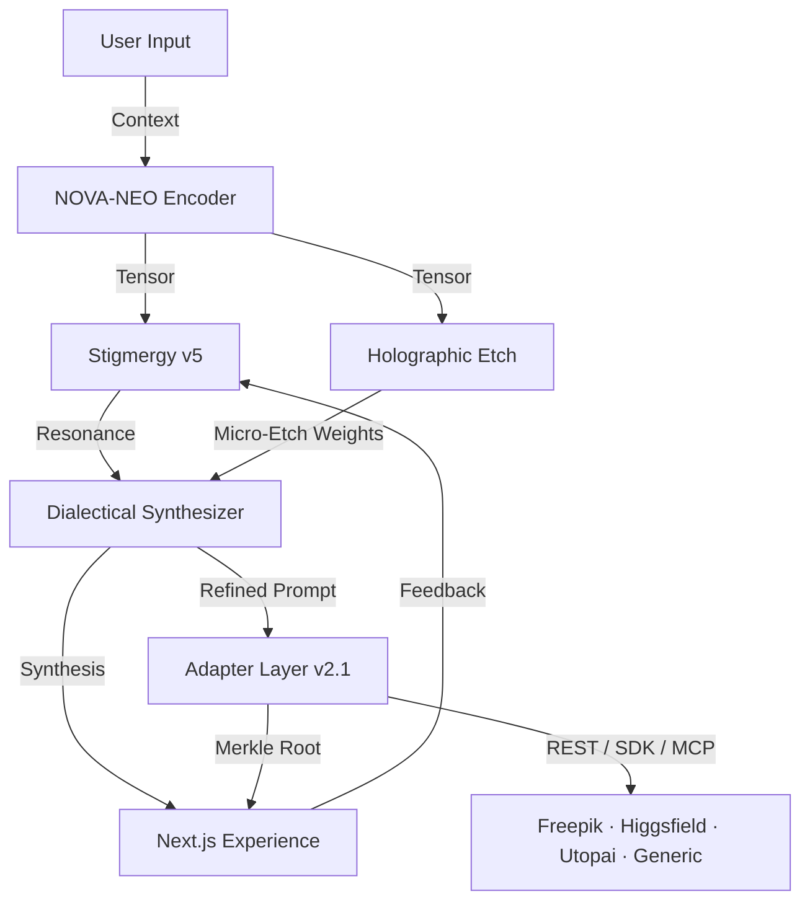

# MCOP Framework 2.0 🌌

[](https://github.com/Kuonirad/KullAILABS-MCOP-Framework-2.0/actions/workflows/ci.yml)
[](https://github.com/Kuonirad/KullAILABS-MCOP-Framework-2.0/actions/workflows/codeql.yml)
[](https://github.com/Kuonirad/KullAILABS-MCOP-Framework-2.0/releases)
[](LICENSE)
[](https://github.com/Kuonirad/KullAILABS-MCOP-Framework-2.0/graphs/contributors)
[](./GOVERNANCE.md)

Meta-Cognitive Optimization Protocol for deterministic, auditable triad orchestration: **NOVA-NEO Encoder**, **Stigmergy v5 Resonance**, and **Holographic Etch Engine**. Built with Next.js + TypeScript and ready for research, prototyping, and production hardening.

> Crystalline entropy targets, Merkle-tracked pheromones, and rank-1 micro-etches—packaged for real-world deployment.

MCOP also ships the **Universal MCOP Adapter Integration Protocol v2.1**, a SDK-agnostic contract that wires the deterministic triad to external creative-production platforms (Freepik, Higgsfield, Utopai, and any generic REST/MCP/HTTP pipeline) without modifying core. See [docs/adapters/UNIVERSAL_ADAPTER_PROTOCOL.md](docs/adapters/UNIVERSAL_ADAPTER_PROTOCOL.md).

## 🔭 Vision
- **Deterministic cognition**: Reproducible context tensors with explicit entropy metrics.
- **Provenance-first**: Merkle-style lineage for every pheromone trace and etch update.
- **Hardware-aware**: Clear seams for GPU/FPGA acceleration of rank-1 updates and similarity search.
- **Human-in-the-loop**: Dialectical synthesis loop that embraces audits, overrides, and replay.

## 📖 Plain-English Glossary
New to the framework vocabulary? [PLAIN_ENGLISH_GLOSSARY.md](PLAIN_ENGLISH_GLOSSARY.md) translates every custom term (NOVA-NEO, Stigmergy, Holographic Etch, pheromone traces, dialectical synthesis, P_GoT, the ROADMAP's ecological metaphors, etc.) into plain English and documents the additive code aliases (`SharedTraceMemoryV5`, `ContextTensorEncoder`, `ChangeAuditLogger`, `HumanReviewRefinementLoop`, `MemoryTraceRecord`, `TraceabilityRecord`) that resolve to the same constructs as their canonical names.

## 📐 Architecture
See [ARCHITECTURE.md](ARCHITECTURE.md) for diagrams and data flows.



## 🧠 Active Kernels
- **NOVA-NEO Encoder**: Deterministic hashing pipeline to generate fixed-dimension tensors with optional normalization and entropy estimates.
- **Stigmergy v5**: Vector pheromone store with cosine resonance scoring, configurable thresholds, and Merkle-proof hashes.
- **Holographic Etch**: Rank-1 micro-etch accumulator that tracks confidence deltas and exposes replayable audit trails.

## 🔌 Universal Adapter Protocol (v2.1)
MCOP adapters wire the cognitive triad to external creative-production platforms behind a uniform `IMCOPAdapter` contract. Adapters never modify core — they only call `encoder.encode()`, query `stigmergy.getResonance()`, route through the dialectical synthesizer for human-in-the-loop refinement, persist a `holographicEtch.applyEtch()` Merkle root, and dispatch the refined prompt to the vendor SDK.

Shipped adapters:

| Adapter | Language | Domain | Module |
| --- | --- | --- | --- |
| **Freepik** | TypeScript | Image / video / upscale (REST + MCP) | [`src/adapters/freepikAdapter.ts`](src/adapters/freepikAdapter.ts) |
| **Higgsfield** | Python | Cinematic video (Kling 3.0 / Veo 3.1 / Sora 2 / Seedance) | [`mcop_package/mcop/adapters/higgsfield_adapter.py`](mcop_package/mcop/adapters/higgsfield_adapter.py) |
| **Utopai** | TypeScript | Long-form narrative film engine | [`src/adapters/utopaiAdapter.ts`](src/adapters/utopaiAdapter.ts) |
| **xAI / Grok** | TypeScript | LLM chat completions + entropy/resonance routing | [`src/adapters/grokAdapter.ts`](src/adapters/grokAdapter.ts) |
| **Devin Sub-Agents** | TypeScript | Researcher → Coder → Reviewer orchestration with Merkle-rooted audit chain | [`src/adapters/devinOrchestratorAdapter.ts`](src/adapters/devinOrchestratorAdapter.ts) |
| **Generic Production** | TypeScript | 20-line scaffold for any REST / MCP / HTTP pipeline | [`src/adapters/genericProductionAdapter.ts`](src/adapters/genericProductionAdapter.ts) |

Live integration tracker: [`INTEGRATIONS.md`](INTEGRATIONS.md).

Quick start (TypeScript):

```ts
import {
  HolographicEtch,
  NovaNeoEncoder,
  StigmergyV5,
} from '@/core';
import { FreepikMCOPAdapter } from '@/adapters';

const adapter = new FreepikMCOPAdapter({
  encoder: new NovaNeoEncoder({ dimensions: 64, normalize: true }),
  stigmergy: new StigmergyV5({ resonanceThreshold: 0.4 }),
  etch: new HolographicEtch({ confidenceFloor: 0 }),
  client: freepikClient, // your SDK / MCP wrapper
});

const { result, merkleRoot, provenance } = await adapter.generateOptimizedImage(
  'aurora-lit cathedral at dawn, painterly mood',
  { model: 'mystic', resolution: '4k' },
);
```

Quick start (Python — Higgsfield):

```python
from mcop.adapters import HiggsfieldMCOPAdapter

adapter = HiggsfieldMCOPAdapter(client=higgsfield_sdk)
response = adapter.optimize_cinematic_video(
    "wide aerial of a glacier at sunrise",
    motion_refs=["push-in", "low-angle"],
)
print(response.result.model, response.merkle_root)
```

More: end-to-end runnable scripts under [`examples/`](examples/) (`freepik_production_flow.ts`, `higgsfield_cinematic_pipeline.py`, `multi_platform_orchestrator.ts`).

Every adapter call returns a `ProvenanceMetadata` bundle (tensor hash, Stigmergy trace hash, resonance score, etch Merkle root, refined prompt) that can be persisted for compliance and replay. Human overrides flow through `HumanFeedback` — including a hard `veto` that raises `HumanVetoError` and refuses dispatch.

## 🏁 Getting Started

### Prerequisites
- Node.js 20+ (see `.nvmrc`)
- pnpm 9+ (pinned via `package.json` → `packageManager`; Corepack recommended)

### Installation
```bash
git clone https://github.com/Kuonirad/KullAILABS-MCOP-Framework-2.0.git
cd KullAILABS-MCOP-Framework-2.0
corepack enable                           # first-time only
pnpm install --frozen-lockfile
```

### Development
```bash
pnpm dev          # Next.js dev server with triad modules available under src/core
pnpm test         # Jest suite (security + triad seeds)
pnpm typecheck    # strict TypeScript check, no emit
pnpm lint         # ESLint, zero-warning budget
```
Visit `http://localhost:3000` after starting the dev server.

### Docker Compose
```bash
cp .env.example .env
docker compose up -d
```
For local code mounting add `docker-compose.override.yml`:
```yaml
services:
  mcop-app:
    build: .
    volumes:
      - .:/app
    environment:
      - NODE_ENV=development
```

## 🧩 Triad SDK (TypeScript)
Minimal usage of the triad seeds introduced in `src/core`:
```ts
import { NovaNeoEncoder } from './src/core/novaNeoEncoder';
import { StigmergyV5 } from './src/core/stigmergyV5';
import { HolographicEtch } from './src/core/holographicEtch';

const encoder = new NovaNeoEncoder({ dimensions: 64, normalize: true });
const stigmergy = new StigmergyV5();
const etch = new HolographicEtch();

const context = encoder.encode('dialectical synthesis');
const trace = stigmergy.recordTrace(context, context, { note: 'bootstrap' });
const resonance = stigmergy.getResonance(context);
const etchRecord = etch.applyEtch(context, trace.synthesisVector, 'unit test');
```

For a higher-level surface that bundles encode → resonance → dialectical refinement → etch into a single call (and dispatches to a platform SDK), see the [Universal Adapter Protocol](#-universal-adapter-protocol-v21) above.

Configuration knobs live in [`config/examples/mcop.config.example.json`](config/examples/mcop.config.example.json) and map directly to constructor parameters.

## 🧪 Validation
- Jest tests cover security baselines and triad seed behaviors.
- Deterministic hashing avoids side effects in CI.
- Provenance hashes and audit-friendly logging enable replay.

## 🤝 Contributing

Contributors welcome. The project follows a lightweight governance model with lazy consensus on changes and an open review process.

- **Quickstart:** [CONTRIBUTOR_ONBOARDING.md](CONTRIBUTOR_ONBOARDING.md) — 30-minute runway for new contributors.
- **Good first issues:** [issues labeled `good first issue`](../../issues?q=is%3Aissue+is%3Aopen+label%3A%22good+first+issue%22).
- **Governance:** [GOVERNANCE.md](GOVERNANCE.md) — maintainers, decision model, and release process.
- **Protocol:** [CONTRIBUTING.md](CONTRIBUTING.md) — branch hygiene, PR template, and review expectations.

Topics: `typescript`, `nextjs`, `agent-framework`, `collective-intelligence`, `stigmergy`, `meta-cognitive-optimization`.

## 🔒 Security
Responsible disclosure details are in [SECURITY.md](SECURITY.md). No secrets belong in source; tests guard against accidental leaks.

## 🪪 License

The MCOP Framework 2.0 is licensed under the **Business Source License 1.1** (BUSL 1.1) — see [LICENSE](LICENSE). On **2030-04-26** the codebase as of that date automatically converts to the **MIT License**.

- Personal, internal-business, academic, and research use is permitted.
- Production use that competes with the Licensor's paid offerings (e.g. hosted services, embedded commercial products) requires a separate commercial license — contact kevinkull.kk@gmail.com.
- Commits and releases prior to 2026-04-26 remain available under MIT — see [LICENSE-MIT-LEGACY](LICENSE-MIT-LEGACY) and [NOTICE.md](NOTICE.md) for the full transition story.

© 2025-2026 Kevin John Kull (Kuonirad) and KullAILABS MCOP Framework contributors.
